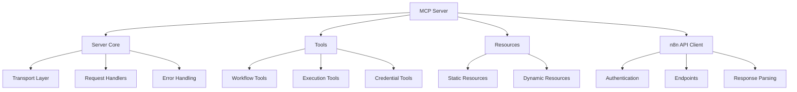

# n8n Workflow Builder MCP Server Plan

## Overview

This document outlines the plan for creating a Model Context Protocol (MCP) server that enables programmatic creation and management of n8n workflows. The MCP server will provide tools and resources for interacting with n8n's REST API, allowing AI assistants to build, modify, and manage workflows without direct user intervention.

## What is n8n?

n8n is an open-source workflow automation tool that allows users to connect various services and APIs to create automated workflows. It provides a visual interface for building workflows, as well as a REST API for programmatic access.

## Existing Implementations

Several MCP servers for n8n workflow management already exist:

1. **[n8n-workflow-builder](https://github.com/makafeli/n8n-workflow-builder)** (by makafeli) - A mature MCP server with 134 stars on GitHub

   - Provides tools for workflow management (create, read, update, delete)
   - Supports workflow activation/deactivation
   - Includes execution management
   - Last updated: February 2025

2. **[mcp-n8n-workflow-builder](https://github.com/salacoste/mcp-n8n-workflow-builder)** (by salacoste) - Implementation focused on Claude/Cursor integration

   - Features intelligent detection of trigger nodes
   - Handles compatibility with the n8n API
   - Includes enhanced workflow testing and error handling

3. **[n8n-mcp-server](https://github.com/illuminaresolutions/n8n-mcp-server)** (by illuminaresolutions) - A more general n8n MCP server implementation
   - Provides access to n8n workflows, executions, credentials, and more
   - Designed for secure and standardized interaction with n8n instances

### Lessons Learned from Existing Implementations

Based on open issues and discussions in these repositories:

1. **Workflow Complexity Handling**:

   - Issue: Complex workflows with many nodes and connections can be difficult to create programmatically
   - Solution: Implement a modular approach with templates and building blocks

2. **API Version Compatibility**:

   - Issue: n8n API changes between versions can break functionality
   - Solution: Implement version detection and compatibility layers

3. **Error Handling and Validation**:

   - Issue: Insufficient error handling leads to cryptic failures
   - Solution: Comprehensive validation with Zod and detailed error messages

4. **Credential Management**:
   - Issue: Secure handling of credentials is challenging
   - Solution: Implement secure credential storage and reference mechanisms

## Architecture

Following the architecture pattern of [mcp-omnisearch](https://github.com/spences10/mcp-omnisearch), our implementation will use a modular approach:



### Core Components

1. **Server Core**

   - Handles MCP protocol communication
   - Manages request/response lifecycle
   - Implements error handling and logging

2. **n8n API Client**

   - Manages authentication with n8n API
   - Implements all necessary API endpoints
   - Handles response parsing and error handling

3. **Tools Module**

   - Implements MCP tools for workflow management
   - Provides execution management tools
   - Includes credential management tools

4. **Resources Module**

   - Provides static resources (e.g., node types, workflow templates)
   - Implements dynamic resource templates (e.g., workflow details)

5. **Schema Validation**
   - Uses Zod for comprehensive schema validation
   - Validates both input and output data
   - Provides detailed error messages

## Schema Design with Zod

We'll use Zod for schema validation throughout the application. Here's an example of how we'll define schemas:

```typescript
import { z } from "zod";

// Node schema
export const NodeSchema = z.object({
	id: z.string(),
	name: z.string(),
	type: z.string(),
	position: z.object({
		x: z.number(),
		y: z.number(),
	}),
	parameters: z.record(z.any()).optional(),
	typeVersion: z.number().optional(),
	credentials: z.record(z.any()).optional(),
});

// Connection schema
export const ConnectionSchema = z.object({
	node: z.string(),
	type: z.string(),
	index: z.number(),
});

// Workflow schema
export const WorkflowSchema = z.object({
	id: z.string().optional(),
	name: z.string(),
	active: z.boolean().optional(),
	nodes: z.array(NodeSchema),
	connections: z.record(z.record(z.array(ConnectionSchema))),
	settings: z.record(z.any()).optional(),
	tags: z.array(z.string()).optional(),
});

// Create workflow input schema
export const CreateWorkflowInputSchema = z.object({
	workflow: WorkflowSchema,
	activate: z.boolean().optional(),
});
```

## MCP Tools Implementation

### Workflow Management Tools

1. **list_workflows**

   - Lists all workflows from n8n
   - Supports filtering by tags, active status
   - Returns paginated results

2. **create_workflow**

   - Creates a new workflow in n8n
   - Validates workflow structure with Zod
   - Returns created workflow ID and details

3. **get_workflow**

   - Retrieves a workflow by its ID
   - Returns complete workflow structure
   - Includes execution statistics

4. **update_workflow**

   - Updates an existing workflow
   - Supports partial updates
   - Validates changes with Zod

5. **delete_workflow**

   - Deletes a workflow by its ID
   - Confirms deletion success
   - Option to archive instead of delete

6. **activate_workflow**

   - Activates a workflow by its ID
   - Validates workflow can be activated
   - Returns activation status

7. **deactivate_workflow**
   - Deactivates a workflow by its ID
   - Returns deactivation status

### Execution Management Tools

1. **list_executions**

   - Lists all workflow executions
   - Supports filtering by workflow, status, date
   - Returns paginated results

2. **get_execution**

   - Retrieves details of a specific execution
   - Includes execution data and results
   - Shows node-by-node execution details

3. **delete_execution**
   - Deletes an execution by its ID
   - Confirms deletion success

### Credential Management Tools

1. **list_credentials**

   - Lists all credential sets
   - Filters by type, name
   - Excludes sensitive information

2. **create_credential**

   - Creates a new credential set
   - Securely handles sensitive information
   - Validates credential structure

3. **delete_credential**
   - Deletes a credential set by its ID
   - Confirms deletion success

## MCP Resources Implementation

### Static Resources

1. **/nodes**

   - List of all available n8n nodes
   - Includes node descriptions and capabilities
   - Updated periodically from n8n GitHub repository

2. **/workflows**
   - List of all available workflows
   - Includes basic workflow information
   - Updated in real-time from n8n API

### Dynamic Resource Templates

1. **/workflows/{id}**

   - Detailed information about a specific workflow
   - Includes complete workflow structure
   - Updated in real-time from n8n API

2. **/executions/{id}**
   - Detailed information about a specific execution
   - Includes execution data and results
   - Shows node-by-node execution details

## Implementation Plan

### Phase 1: Core Infrastructure

1. Set up project structure

   - Initialize TypeScript project
   - Configure build system
   - Set up testing framework

2. Implement MCP server core

   - Set up MCP protocol handling
   - Implement request/response lifecycle
   - Configure error handling and logging

3. Create n8n API client
   - Implement authentication
   - Create base API request functionality
   - Add response parsing and error handling

### Phase 2: Basic Workflow Management

1. Implement workflow schemas with Zod

   - Define node schema
   - Create connection schema
   - Build complete workflow schema

2. Add basic workflow management tools

   - Implement list_workflows
   - Create get_workflow
   - Add create_workflow

3. Implement workflow resources
   - Add /workflows static resource
   - Create /workflows/{id} dynamic resource

### Phase 3: Advanced Features

1. Add execution management

   - Implement list_executions
   - Create get_execution
   - Add delete_execution

2. Implement credential management

   - Add list_credentials
   - Create create_credential
   - Implement delete_credential

3. Add workflow activation/deactivation
   - Implement activate_workflow
   - Create deactivate_workflow

### Phase 4: Testing and Documentation

1. Create comprehensive tests

   - Unit tests for all components
   - Integration tests with n8n API
   - End-to-end tests with MCP client

2. Write documentation

   - API documentation
   - Usage examples
   - Installation and configuration guide

3. Create example workflows
   - Simple workflow examples
   - Complex workflow templates
   - Integration examples with popular services

## Configuration

The MCP server will be configured via environment variables:

```typescript
// Environment variables
export const config = {
	// n8n API configuration
	n8nHost: process.env.N8N_HOST || "http://localhost:5678/api/",
	n8nApiKey: process.env.N8N_API_KEY || "",

	// MCP server configuration
	serverName: process.env.SERVER_NAME || "n8n-workflow-builder",
	serverVersion: process.env.SERVER_VERSION || "1.0.0",

	// Logging configuration
	logLevel: process.env.LOG_LEVEL || "info",

	// Cache configuration
	cacheEnabled: process.env.CACHE_ENABLED === "true",
	cacheTTL: parseInt(process.env.CACHE_TTL || "300", 10),
};
```

## Security Considerations

1. **API Key Management**

   - Secure storage of n8n API key
   - No hardcoding of credentials
   - Environment variable based configuration

2. **Input Validation**

   - Comprehensive validation with Zod
   - Sanitization of user input
   - Prevention of injection attacks

3. **Error Handling**

   - Detailed error messages for developers
   - Sanitized error messages for users
   - No leaking of sensitive information

4. **Rate Limiting**
   - Implementation of rate limiting
   - Prevention of API abuse
   - Configurable limits

## Conclusion

This MCP server will provide a powerful interface for AI assistants to create and manage n8n workflows. By leveraging the lessons learned from existing implementations and following best practices for MCP server development, we can create a robust and secure solution.

The modular architecture and comprehensive schema validation will ensure that the server is maintainable and extensible, while the comprehensive tool and resource implementations will provide a rich interface for AI assistants to work with.
