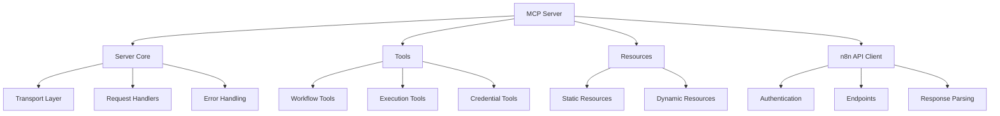

# n8n Workflow Builder MCP Server Plan

## Overview

This document outlines the plan for the Model Context Protocol (MCP)
server that enables programmatic creation and management of n8n
workflows. The MCP server provides tools and resources for interacting
with n8n's REST API, allowing AI assistants to build, modify, and
manage workflows without direct user intervention.

## What is n8n?

n8n is an open-source workflow automation tool that allows users to
connect various services and APIs to create automated workflows. It
provides a visual interface for building workflows, as well as a REST
API for programmatic access.

## Existing Implementations

Several MCP servers for n8n workflow management already exist:

1. **[n8n-workflow-builder](https://github.com/makafeli/n8n-workflow-builder)**
   (by makafeli) - A mature MCP server with 134 stars on GitHub

   - Provides tools for workflow management (create, read, update,
     delete)
   - Supports workflow activation/deactivation
   - Includes execution management
   - Last updated: February 2025

2. **[mcp-n8n-workflow-builder](https://github.com/salacoste/mcp-n8n-workflow-builder)**
   (by salacoste) - Implementation focused on Claude/Cursor
   integration

   - Features intelligent detection of trigger nodes
   - Handles compatibility with the n8n API
   - Includes enhanced workflow testing and error handling

3. **[n8n-mcp-server](https://github.com/illuminaresolutions/n8n-mcp-server)**
   (by illuminaresolutions) - A more general n8n MCP server
   implementation
   - Provides access to n8n workflows, executions, credentials, and
     more
   - Designed for secure and standardized interaction with n8n
     instances

### Lessons Learned from Existing Implementations

Based on open issues, discussions in these repositories, and our own
testing:

1. **Workflow Complexity Handling**:

   - Issue: Complex workflows with many nodes and connections can be
     difficult to create programmatically
   - Solution: Implement a modular approach with templates and
     building blocks

2. **API Version Compatibility**:

   - Issue: n8n API changes between versions can break functionality
   - Solution: Implement version detection and compatibility layers

3. **Error Handling and Validation**:

   - Issue: Insufficient error handling leads to cryptic failures
   - Solution: Comprehensive validation with Zod and detailed error
     messages

4. **Credential Management**:

   - Issue: Secure handling of credentials is challenging
   - Solution: Implement secure credential storage and reference
     mechanisms

5. **Schema Validation vs. API Expectations**:

   - Issue: Discrepancies between schema validation and what the n8n
     API actually expects
   - Example: Our schema initially defined `position` as an object
     with `x` and `y` properties, but the n8n API expects an array [x,
     y]
   - Solution: Align schema validation with actual API expectations or
     implement transformation layers

6. **API Endpoint Format**:

   - Issue: Confusion about the correct API endpoint format
   - Solution: Use the standard format `/api/v1` without the
     `/settings` part

7. **Workflow Activation Requirements**:
   - Issue: Not all workflows can be activated
   - Solution: Document that activating a workflow requires at least
     one trigger node that can automatically start the workflow
     (schedule, webhook, etc.)

## Architecture

Following the architecture pattern of
[mcp-omnisearch](https://github.com/spences10/mcp-omnisearch), our
implementation uses a modular approach:



### Core Components

1. **Server Core**

   - Handles MCP protocol communication
   - Manages request/response lifecycle
   - Implements error handling and logging

2. **n8n API Client**

   - Manages authentication with n8n API
   - Implements all necessary API endpoints
   - Handles response parsing and error handling

3. **Tools Module**

   - Implements MCP tools for workflow management
   - Provides execution management tools
   - Includes credential management tools

4. **Resources Module**

   - Provides static resources (e.g., node types, workflow templates)
   - Implements dynamic resource templates (e.g., workflow details)

5. **Schema Validation**
   - Uses Zod for comprehensive schema validation
   - Validates both input and output data
   - Provides detailed error messages

## Schema Design with Zod

We use Zod for schema validation throughout the application. Here's an
example of how we define schemas:

```typescript
import { z } from 'zod';

// Node schema
export const NodeSchema = z.object({
	id: z.string(),
	name: z.string(),
	type: z.string(),
	position: z.array(z.number()).length(2),
	parameters: z.record(z.any()).optional(),
	typeVersion: z.number().optional(),
	credentials: z.record(z.any()).optional(),
});

// Connection schema
export const ConnectionSchema = z.object({
	node: z.string(),
	type: z.string(),
	index: z.number(),
});

// Workflow schema
export const WorkflowSchema = z.object({
	id: z.string().optional(),
	name: z.string(),
	active: z.boolean().optional(),
	nodes: z.array(NodeSchema),
	connections: z.record(z.record(z.array(ConnectionSchema))),
	settings: z.record(z.any()).optional(),
	tags: z.array(z.string()).optional(),
});

// Create workflow input schema
export const CreateWorkflowInputSchema = z.object({
	workflow: WorkflowSchema,
	activate: z.boolean().optional(),
});
```

## Implementation Status

### Completed Features

1. **Core Infrastructure**

   - MCP server setup with @modelcontextprotocol/sdk
   - n8n API client implementation with robust error handling
   - Comprehensive schema validation with Zod
   - Detailed error handling and logging
   - Published to npm as `mcp-n8n-builder` for easy installation

2. **Workflow Management Tools**

   - list_workflows: List all workflows with filtering options
   - create_workflow: Create new workflows with optional activation
   - get_workflow: Get detailed workflow information
   - update_workflow: Update existing workflows
   - delete_workflow: Delete workflows
   - activate_workflow: Activate workflows
   - deactivate_workflow: Deactivate workflows

3. **Execution Management Tools**

   - list_executions: List workflow executions with filtering
   - get_execution: Get detailed execution information

4. **Output Verbosity Control**

   - Configurable output verbosity (concise vs. full)
   - Preserves context window space when working with LLMs
   - Per-request verbosity control for specific tools

5. **Documentation**
   - Comprehensive API reference
   - Detailed setup guide
   - Usage examples with Claude
   - Schema reference
   - n8n API endpoints documentation
   - n8n API client implementation details
   - Future enhancements roadmap

### In Progress

1. **Workflow Execution Features**

   - execute_workflow: Manually execute workflows by ID
   - Improved error handling for workflow execution

2. **Advanced Trigger Node Handling**
   - Intelligent detection of trigger nodes
   - Automatic addition of trigger nodes when required for activation

### Planned Features

1. **Workflow Templates**

   - Predefined workflow templates for common use cases
   - create_workflow_from_template tool
   - Customizable templates with parameters
   - Library of common node configurations

2. **Tag Management**

   - list_tags: List all workflow tags
   - create_tag: Create new tags
   - update_tag: Update existing tags
   - delete_tag: Delete tags
   - assign_tag: Assign tags to workflows
   - remove_tag: Remove tags from workflows

3. **Advanced Workflow Management**

   - import_workflow: Import workflows from JSON or n8n backup
   - export_workflow: Export workflows to JSON
   - clone_workflow: Create a copy of an existing workflow
   - workflow_versioning: Track and manage workflow versions

4. **Enhanced Execution Management**

   - retry_execution: Retry failed executions
   - delete_execution: Delete execution records
   - execution_history: View execution history for a workflow
   - execution_logs: View detailed logs for an execution

5. **Credential Management**

   - list_credentials: List all credential configurations
   - get_credential: Get credential configuration details
   - create_credential: Create new credential configurations
   - update_credential: Update credential configurations
   - delete_credential: Delete credential configurations

6. **Variable Management**

   - list_variables: List all variables
   - get_variable: Get variable details
   - create_variable: Create new variables
   - update_variable: Update variable values
   - delete_variable: Delete variables

7. **Enhanced Security**
   - API key rotation
   - Rate limiting
   - Access control
   - Improved error handling and validation

## Next Steps

### Short-term (1-2 weeks)

1. Implement execute_workflow functionality
2. Add intelligent trigger node handling
3. Implement workflow templates system
4. Add tag management tools
5. Enhance error handling for common n8n API issues

### Medium-term (1-2 months)

1. Implement workflow import/export
2. Add workflow versioning
3. Enhance execution management with retry functionality
4. Implement credential management
5. Add more comprehensive testing

### Long-term (3+ months)

1. Implement variable management
2. Add enhanced security features
3. Create a web UI for managing the MCP server
4. Add support for n8n cloud instances
5. Implement workflow analytics and monitoring

## Usage Notes

Most users will interact with this tool through MCP configuration
files rather than direct installation. A typical configuration in an
MCP settings file would look like:

```json
{
	"n8n-workflow-builder": {
		"command": "npx",
		"args": ["-y", "mcp-n8n-builder"],
		"env": {
			"N8N_HOST": "https://examplehost.com/api/v1",
			"N8N_API_KEY": "secretkey",
			"OUTPUT_VERBOSITY": "concise"
		}
	}
}
```

This approach allows for easy integration with AI assistants like
Claude without requiring users to manually install or configure the
tool.

## Conclusion

The n8n Workflow Builder MCP server provides a powerful interface for
AI assistants to create and manage n8n workflows. By leveraging the
n8n REST API and the Model Context Protocol, we enable seamless
integration between AI assistants and workflow automation.

The project is published on npm as `mcp-n8n-builder` with core
functionality implemented. We continue to work on enhancing the
feature set and improving the user experience based on feedback from
the community and comparison with other implementations.
